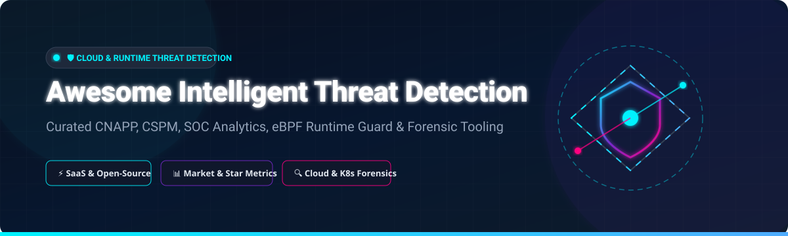

# 🛡️ Awesome Intelligent Threat Detection 🚀

    

## 📌 Overview & Scope

Welcome to the **Awesome Intelligent Threat Detection** repository! 🚀 This is a comprehensive, community-curated ecosystem guide covering top **SaaS/Hosted Enterprise Platforms** and powerful **Open-Source Security Tools**. 

Focusing on **Cloud Threat Detection**, **Cloud Native Application Protection Platforms (CNAPP)**, **Cloud Security Posture Management (CSPM)**, **eBPF Workload Runtime Protection**, **SIEM/XDR Analytics**, and **Cloud Forensics & Incident Response**, this list helps security engineers, cloud architects, DevSecOps teams, and SOC analysts choose the right defense mechanisms for multi-cloud (AWS, Azure, GCP) and Kubernetes environments. 🛡️

---

## 📑 Table of Contents

- [📈 Market Size & Industry Dynamics](#-market-size--industry-dynamics)
- [🏢 SaaS & Hosted Enterprise Platforms](#-saas--hosted-enterprise-platforms)
- [🔓 Open-Source GitHub Projects](#-open-source-github-projects)
- [🤝 How to Contribute](#-how-to-contribute)
- [☕ Support & Sponsorship](#-support--sponsorship)
- [⭐ Star History](#-star-history)
- [⚠️ Disclaimer](#%EF%B8%8F-disclaimer)

---

## 📈 Market Size & Industry Dynamics

> 💡 **Market Size & Structure**: The global **Cloud Threat Detection & CNAPP Market** is estimated at **~$12.5 Billion in 2026** (growing at a CAGR of ~22.4%). The market is **moderately concentrated at the high end (winner-take-most dynamics for top CNAPP suites)** led by consolidated players like Palo Alto Networks, CrowdStrike, and Microsoft, alongside massive pure-play acquisitions (e.g., Google's $32B acquisition of Wiz). Meanwhile, the **open-source ecosystem remains highly fragmented** with specialized tools excelling in niche domains such as eBPF runtime monitoring, SQL cloud querying, and CLI forensic fan-out.

---

## 🏢 SaaS & Hosted Enterprise Platforms

The table below lists leading commercial SaaS platforms evaluated by valuation/revenue (descending), starting tier pricing, free tier/trial limits, and key focus areas:

| Logo / Platform 🌐 | Enterprise Size (Valuation / Revenue) 💰 | Starting Tier Pricing 💵 | Free Tier / Trial Limit 🎁 | Core Focus & Highlights 🔍 |
| :--- | :--- | :--- | :--- | :--- |
| **[Microsoft Defender for Cloud](https://azure.microsoft.com/en-us/products/defender-for-cloud/)** 🛡️ | **$3.1 Trillion** (Parent Mkt Cap) | **~$15/server/month** (Defender for Servers Plan 2); €0.0039/vCPU/hr | **Foundational CSPM Free Forever** (Unlimited continuous assessment & security score) | Microsoft native CNAPP & CSPM with agentless vulnerability scanning, attack path analysis, and M365 E5 integration. |
| **[Palo Alto Prisma Cloud](https://www.paloaltonetworks.com/prisma/cloud)** 🔒 | **~$110 Billion** (Mkt Cap) | **~$90,000/year** (~$300/credit commitment) | **30-Day Free Trial** (Full featured CNAPP evaluation with cloud account scan) | Broadest CNAPP coverage combining posture management, container/workload security (Twistlock), and IaC scanning (Bridgecrew). |
| **[CrowdStrike Falcon Cloud Security](https://www.crowdstrike.com/products/cloud-security/)** 🦅 | **~$85 Billion** (Mkt Cap) | **~$150/agent/year** (Falcon Cloud Security starting module) | **15-Day Free Trial** (Includes Falcon Cloud Security & Cloud Security Posture Management) | Unified cloud security integrated directly into CrowdStrike Falcon EDR with agentless + agent-based protection. |
| **[Datadog Cloud Security](https://www.datadoghq.com/)** 📊 | **~$40 Billion** (Mkt Cap) | **$7.50/host/month** (Cloud Security Management Pro) | **14-Day Free Trial** (Full observability + Cloud Security suite access) | Seamless integration of posture management, threat detection, and workload security into Datadog unified APM/logs. |
| **[Wiz](https://www.wiz.io/)** 🧙‍♂️ | **$32 Billion** (Acquired by Google) | **~$80,000/year** (Standard enterprise starter tier) | **30-Day Free Trial** (Includes agentless SideScanning™ scan on up to 500 cloud instances) | Market-leading agentless CNAPP with graph-based attack path analysis and risk prioritization. |
| **[Orca Security](https://orca.security/)** 🐋 | **~$1.8 Billion** (Valuation) | **~$60,000/year** (Standard enterprise starting tier) | **30-Day Free Trial** (Agentless SideScanning on full cloud environment) | Pioneer of agentless SideScanning™ technology providing full-stack CSPM, CWPP, and vulnerability detection. |
| **[Lacework](https://www.lacework.com/)** ⚡ | **~$1.5 Billion** (Acquired by Fortinet) | **~$50,000/year** (Platform starter subscription) | **14-Day Free Trial** (Full Polygraph® anomaly detection engine evaluation) | ML-driven behavioral analytics and automated cloud anomaly detection with Polygraph Data Platform. |
| **[Sophos Cloud Optix](https://www.sophos.com/)** 🛡️ | **~$4 Billion** (Parent Acquisition) | **~$3.50/asset/month** (Starting cloud resource tier) | **30-Day Free Trial** (Full agentless CSPM scanning across AWS, Azure, GCP) | Agentless cloud security posture management, topology mapping, and threat detection for SMBs & enterprise. |
| **[Amazon GuardDuty](https://aws.amazon.com/guardduty/)** ☁️ | **AWS Native** ($100B+ Run Rate) | **$1.00/GB CloudTrail logs** ($0.50/million VPC Flow Logs) | **30-Day Free Trial** (First 30 days free for every new AWS account) | AWS managed intelligent threat detection using ML, anomaly detection, and integrated threat intelligence. |
| **[Google Cloud Security Command Center](https://cloud.google.com/security-command-center)** 🔍 | **GCP Native** ($40B+ Run Rate) | **$0.0075/node/hour** (SCC Premium Tier) | **Standard Tier Free Forever** (Basic security health analytics & vulnerability findings) | GCP native centralized risk & threat management platform providing continuous visibility and threat detection. |

---

## 🔓 Open-Source GitHub Projects

Below is a curated collection of top open-source threat detection, CSPM, runtime monitoring, eBPF, and cloud forensic tools sorted by **GitHub Star Count (descending)** 🌟:

-  **[Trivy](https://github.com/aquasecurity/trivy)** 🛡️ — Comprehensive and versatile security scanner for container images, file systems, Git repositories, Kubernetes clusters, and IaC templates.
-  **[Prowler](https://github.com/prowler-cloud/prowler)** ⚡ — De facto open-source CSPM scanner with 300+ security checks across AWS, Azure, GCP, and Kubernetes following CIS, NIST, and ISO standards.
-  **[Checkov](https://github.com/bridgecrewio/checkov)** 📝 — Static code analysis tool for infrastructure-as-code (IaC) supporting Terraform, CloudFormation, Kubernetes, Dockerfile, and ARM templates.
-  **[Falco](https://github.com/falcosecurity/falco)** 🦅 — CNCF Graduated cloud-native runtime security project utilizing eBPF to detect unexpected application behavior and alert on threats in real time.
-  **[Kubescape](https://github.com/kubescape/kubescape)** ☸️ — Kubernetes open-source security platform with GA eBPF runtime threat detection, CEL-based rules, SBOM management, and native AI remediation assistant.
-  **[Steampipe](https://github.com/turbot/steampipe)** 🔍 — Zero-ETL cloud API querying engine powered by SQL. Query cloud resources, IAM policies, and compliance controls like a relational database.
-  **[Wazuh](https://github.com/wazuh/wazuh)** 🐺 — Free and open-source enterprise SIEM and XDR engine for threat detection, integrity monitoring, incident response, and regulatory compliance.
-  **[CloudQuery](https://github.com/cloudquery/cloudquery)** 📊 — High-performance open-source ELT framework for cloud asset inventory, security compliance, and infrastructure analysis using SQL.
-  **[Kube-bench](https://github.com/aquasecurity/kube-bench)** 🧪 — Automated checker verifying whether Kubernetes clusters are deployed securely according to CIS Kubernetes Benchmarks.
-  **[tfsec](https://github.com/aquasecurity/tfsec)** 🔒 — Lightweight static analysis security scanner for Terraform code with fast execution and zero external dependencies.
-  **[Cartography](https://github.com/lyft/cartography)** 🗺️ — Graph-based cloud infrastructure security tool by Lyft that consolidates assets and relationships into Neo4j for attack path analysis.
-  **[Zeek](https://github.com/zeek/zeek)** 📡 — Powerful open-source network security monitoring platform that translates raw network traffic into structured security logs.
-  **[ScoutSuite](https://github.com/nccgroup/ScoutSuite)** 🕵️ — Multi-cloud security auditing tool from NCC Group providing HTML reports across AWS, Azure, GCP, Alibaba, and Oracle Cloud.
-  **[Suricata](https://github.com/OISF/suricata)** 🚨 — High-performance Network IDS, IPS, and Network Security Monitoring engine supported by OISF.
-  **[Tracee](https://github.com/aquasecurity/tracee)** 🔎 — Linux runtime security and forensic tool built on eBPF by Aqua Security for real-time threat detection and container monitoring.
-  **[CloudSploit](https://github.com/aquasecurity/cloudsploit)** ⚡ — Open-source cloud security scanner by Aqua Security for detecting AWS, Azure, GCP, and Oracle Cloud misconfigurations.
-  **[Malcolm](https://github.com/cisagov/Malcolm)** 🌊 — Powerful network traffic analysis suite developed by CISA featuring full packet capture, Zeek log aggregation, and Suricata alerts.
-  **[RITA](https://github.com/activecm/rita)** 📡 — Real Intelligence Threat Analytics tool by Active Countermeasures for detecting C2 beacons and network tunneling.
-  **[node-agent (Kubescape)](https://github.com/kubescape/node-agent)** 🤖 — Runtime threat detection agent for Kubernetes nodes leveraging eBPF, CEL expressions, and Inspektor Gadget telemetry.
-  **[XCLOAK Security Suite](https://github.com/The-Abhishek1/XCLOAK-SECURITY-SUITE)** 🛡️ — All-in-one self-hosted enterprise SOC platform combining SIEM, SOAR, EDR, DPI, and 15+ detection modules in a single stack.
-  **[UTMStack](https://github.com/utmstack/UTMStack)** 🧱 — Next-gen open-source SIEM & XDR platform delivering compliance management, threat intelligence, and log correlation.
-  **[Magpie](https://github.com/HermesSF/magpie)** 🦅 — Open-source CSPM framework focused on cloud ransomware mitigation and supply chain attack detection.
-  **[Argus](https://github.com/nssriraam/argus)** 🎯 — AWS & Azure cloud forensics platform with MITRE ATT&CK attack chain correlation and timestamped chain-of-custody audit trails.
-  **[Dredge](https://pypi.org/project/dredge-ir/)** ⛏️ — Incident response & cloud threat-hunting toolkit for multi-region CloudTrail, GuardDuty, Kubernetes, and GitHub audit logs.
-  **[Nexus Fleet](https://pypi.org/project/nexus-fleet/)** 🚀 — Offline-first security telemetry platform combining Wazuh-style detections with developer-aware monitoring for Laravel, Next.js, and Nginx.

---

## 🤝 How to Contribute

We welcome community contributions! 🎉 To add or update an entry:

1. **Fork** this repository. 🍴
2. **Add/Edit** entries in `README.md` following the standard tabular or list format. ✏️
3. **Ensure details are accurate** (pricing, free tier terms, star link, factual descriptions). 💡
4. **Submit a Pull Request** with a brief summary of your changes. 🚀

---

## ☕ Support & Sponsorship

If you find this repository valuable for your cloud security, DevSecOps, or SOC workflow, please consider supporting the maintenance and ongoing updates! 🌟

- **Star the Repository**: Click the ⭐ button at the top right of this page!
- **Share**: Spread the word to your cybersecurity peers and teams. 📢
- **Sponsor**: Buy me a coffee via the [GitHub Sponsor Dashboard](https://github.com/sponsors/ishandutta2007) ☕

Your support keeps open-source threat detection tooling accessible to everyone! ❤️

---

## ⭐ Star History

---

## ⚠️ Disclaimer

- This list is **community-curated** for educational, architectural, and operational research purposes. Inclusion does not imply official endorsement. ℹ️
- Cloud threat detection solutions process sensitive security telemetry. Self-hosted security platforms require proper access controls, encryption, and compliance validation. 🔒
- Commercial pricing and free tier terms are subject to vendor modifications. Always refer to official product documentation for current enterprise quotes. 🏷️

---

<b>Made with ❤️ for security engineers, cloud architects, and defenders worldwide.</b>

